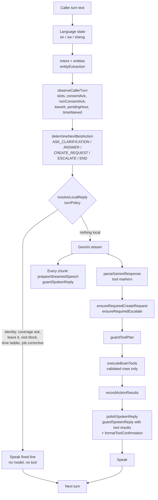

# Brain turn contract

One caller turn, one path. Every playbook (retail, home services, hospitality,
general, and any future pack) runs through the same gates. Playbooks change
what the Brain asks for and what it saves. They cannot change what it is
allowed to say or when a tool may fire. The gates live in code, not in the
prompt, so a model that leaks still cannot reach the caller or the database.
How-are-you, Okay with no job open, and a bare name go to Gemini. The model
answers the last thing said. A which-services ask, in English, Kiswahili, or
a mix, is the catalogue list. `BRAIN_GEMINI_CATALOGUE` defaults off: code
speaks that list from the file. Set it to `on` for a staging listen only.
Gemini then speaks, and the names must be the exact `items[]`. Flip the env
off to revert that mouth. A detail ask (details, more about, what is included)
gets the price or note on file. It does not read the full list. A price ask
for a catalogue service, including "how much is it?" or "ni pesa ngapi?"
after that service is already confirmed, speaks the price or note on file.
It does not say the price is missing when the row has one. Nothing is invented.
"Which service do you offer" is the same list ask as "which services".
The yes after a name confirm continues: which service, or the booking, or
one local file list if that list was still waiting. It does not end the
call. A public fact (price, catalogue, hours, coverage, service facts)
is a speak slot on call state: `conversation.speakSlots[]` with `outcome`,
`line`, and `language`. Brain fills that slot when the fact is ready and
the file-name ask is still due. Voice FactSpeakQueue drains a slot once
that line is spoken. A slot still there after name Yes is unanswered.
Brain hands that same file line back before Gemini runs. Identity alone
does not end the call. Nothing in the slot is invented. Gemini does not
read the catalogue again, and no control label is spoken. Answering the catalogue leaves
the call open. Farewell only when they say goodbye or they are done. Trailing
noise such as "over" is not a visit place. Code still speaks
the catalogue (unless that flag is on), hours, coverage,
leave-it, the visit-time ladder, and tool results. A streamed 503 retries the
same model once if nothing was spoken, then tries the backup model once.
Credits and a denied project are not retried. A shared line does not order "ask who is
speaking" on a greeting or a bookings question. The fact card says not to use
the file name until they say who they are. An empty successful Gemini turn
says "Sorry, say that again?" once. The downtime name-capture stays the
credits-down path. A file read ("which bookings", "previous booking",
"read them", "what do I have on hold") is not a new booking. If this
speaker has nothing saved, Voice says so and does not invent a visit,
an order, or a service list. Home services and retail use the same gate.
A bound file with a real visit or hold is still read by the model. Caller file bind, goal quality, and the summary spine: [`CALLER_IDENTITY_AND_SUMMARY.md`](./CALLER_IDENTITY_AND_SUMMARY.md) and [`../product/CALLER_FILE_MODEL.md`](../product/CALLER_FILE_MODEL.md).

Runtime: `server.js` media loop. Offline twin: `tests/helpers/brainSimulator.js`.
Proof: `tests/brainSimulation.test.js` (in `npm run test:brain`).

## The turn



## Three gates

### 1. State gates (before the model)

Set in `brainState.observeCallerTurn` and read by `nextBestAction`,
`goalModel`, and `turnPolicy`.

| Gate | Rule | Effect |
| --- | --- | --- |
| Consent | `ackIsConsent`: Okay / Sawa / Then is a yes only when the last asked slot was `confirm`. Anywhere else it is a filler (`nonConsentAck`). | Filler never fires a tool. The Brain asks for the next missing fact. |
| Leave it | "Just leave it", "wacha", "forget it" after a block. | Speak "Okay. Nothing saved." No tool. Block line is not repeated. |
| Quantity | An order for a catalogue product needs a count the caller said (digits or words, en/sw). | "Then." asks "Diary. How many?" The saved row never carries a guessed count. |
| Visit time ladder | Day without a clock time asks "What time tomorrow?", then "Morning or afternoon?". A bare hour asks "N in the morning or afternoon?" or "Twelve noon?". | Two asks (or "any time" after one) waive the time: a callback service request is saved with "Visit time to confirm. Place: …". Never a calendar row without a time. |
| Coverage | `assessCoverage`: `inside` when the place or its county matches Train text; `outside` only when the place resolves to a county that is not covered; `unknown` when nobody can place it. A clipped token that is a one-letter prefix of exactly one Kenya name binds (`Ronga` → Rongai), even outside this tenant's counties. A one-edit neighbour binds only inside this tenant's coverage counties. Two substitutions (`rongae`) stay unknown. A two-edit miss binds only to a place in this tenant's coverage counties (`Rwangai` → Rongai when Kitengela is on file). A comma list keeps the token that binds (`Lurungai, Rungai` → Rongai). A split or joined Kiswahili name binds (`na kuru` is Nakuru). An empty coverage directory stays unknown. Coverage is judged before hours. | A coverage answer for an area outside the list ends with the note question in the caller's language. A list on file is never described as missing. A booking rejection and a leave-it stay the short line "That area is outside our coverage." Unknown never refuses. A building replaces a bad token and keeps the resolved area (`The grace apartments, Rongai`). |
| Name particle | When name is open, `Alvin, yeah?` / `eh` / `yes` is the name. | The particle is not stored. |
| Clock | A clock answer keeps the day already stored. A clock is not a quantity. A period stays a period and replaces a stored clock. | A clock outside hours is refused on the turn it is said, even when the name is still missing. The slot drops back to the day and the hours line is spoken on that turn. The name ask waits. `No` does not save that hour. Morning is spoken as morning, not 10:00, and not as a leftover 7:00 AM. The hours line names the open side: after 8 AM, or before 6 PM. |
| Desk card | "Visit request saved" and a refused clock in want require a succeeded visit. A callback does not authorize the refused hour. | No row means done is None. |
| Area | A landmark with no area ("near the big church") while coverage is on file. | One ask: "Which area is that in?" Then book, with `area not confirmed, check coverage` in the notes if the caller cannot say. |
| Urgent contact | "Contact me urgently" needs a name and a concrete need. The name turn is not the need. | Escalate once, after both. Reason reads `Caller says: <need>`. |

### 2. Speech gate (`speechGuard.guardSpokenReply`)

Applied to every Gemini chunk while streaming and again to the final line with
this turn's tool results. Local lines are fixed strings and do not need it.

Dropped sentence by sentence:

- **Numbers the caller, the file, or a tool did not state.** Known set is
  caller turns, profile JSON, tool results, and state entities. Number words
  count (`numberWords.js`), so "twenty" matches "20". "One moment" is not a
  number. Hours on file as `HH:MM` do not authorize a spoken AM/PM visit time. An AM/PM clock is kept only when the caller said that clock or a tool result returned it. The fixed hours line may still name open and close.
- **Saved / booked / noted / "the team will call" / "all set"** unless a tool succeeded
  this turn. A leftover "How else can I help?" after that close is dropped when a slot is still open, so the turn speech guarantee asks the slot.
- **A locality the slot, the caller, and the file do not hold.** "Rongai" is not spoken from a slot that still says an unbound token.
- **Transfer and escalate claims** ("stay on the line", "transferring you", "escalating") unless
  `capabilities.liveTransfer`.
- **Coverage flips** ("we can come to Runda") unless `assessCoverage` says
  inside.
- **Message only booking collection.** When `state.messageOnly` is on, a
  sentence that asks which service to book, or for a day, a time, or a place,
  is dropped. A file answer (services, price, hours, where the business is)
  stays. If the caller is booking, the spoken line is "I'll take a message and
  have the team call you." Serve mode is unchanged.

If the caller asked a price, count, or time and the only answer was dropped,
the line becomes "I don't have that on file. I can note it for the team."
(sw / sheng variants). An empty guard result is only for a dropped close while a
slot is open: the turn then speaks the slot ask or the tool line. Dead air is
still a simulator failure.

### 3. Tool gate (`requiredCreateRequest.guardToolPlan`)

Runs on the parsed markers plus anything the injectors added.

- `ackWithoutConsent` deletes `serviceRequest` and `appointment`.
- A `quantity` the caller never said becomes empty.
- An appointment whose `when` has a day and no time is replaced: with
  `timeWaived`, a callback request; otherwise it is held back
  (`needsVisitTime`) and the Brain asks the time.
- Escalate carries the caller's stated need, not the decision reason.
- `executeBrainTools` still validates rows (hours, catalogue titles, junk
  names) and returns `invalid` instead of writing.
- Escalate speaks one callback line (`Okay. They'll call you back.` / `Sawa. Watakupigia.`).
  Model sentences that narrate the send are dropped, including after the tool
  succeeds. A second escalate on the same call does not notify again and does
  not speak again.

## Invariants the simulator checks after every turn

`dead_air`, `local_line_too_long` (>25 words for a fixed line), `glued_words`,
`saved_claim_without_tool`, `transfer_claim`, `invented_number_N`,
`said_landmark` (home services), `catalogue_dump`, `tool_on_ack`,
`same_question_three_times`. Any violation fails `npm run test:brain`.

## Adding a playbook without a leak

1. Add slots and required order in `goalModel.js` (`GOAL_REQUIREMENTS`,
   `missingGoalSlots`). Do not read the model text for completion.
2. Add the one-line ask for each new slot in `callCorrectives.missingSlotLine`
   (en + sw) and `dynamicSpeech.pickSpeechGuaranteeLine`.
3. Add the prompt hint in `goalModel.clarificationForSlot`.
4. Map the saved row in `requiredCreateRequest` and validate it in
   `toolExecution`. Speak the result from `formatToolConfirmation`.
5. Write a scenario in `tests/brainSimulation.test.js` with the adversarial stub
   and assert `sim.violations` is empty and the saved rows are exact.

Do not:

- Speak a fact the profile does not hold. Put it in the profile or ask.
- Add a local reply outside `turnPolicy.resolveLocalReply`.
- Fire a tool from a spoken line. Tools come from markers or injectors, then
  the tool gate.
- Import `visitTime` from `callCorrectives`, or `toolExecution` from
  `src/conversation` modules (import cycles).

## Simulator

```js
const { createSimulator } = require('./tests/helpers/brainSimulator');
const sim = createSimulator({ profile, leak: 'rotate' }); // or 'none', or a string
await sim.run(['I need carpet cleaning tomorrow.', 'Alvin.', 'Kitengela, near Naivas.', 'Tomorrow.']);
sim.transcript();  // caller / agent lines with the outcome per turn
sim.saved;         // serviceRequests, appointments, appointmentUpdates, escalations
sim.violations;    // [] on a clean call
```

The stub asks for the slot the state wants and adds one leak per turn: a
price, a transfer, a coverage flip, a booking claim, a stock count. On
`CREATE_REQUEST` it claims "Done, that is all booked" with no marker. A clean
run proves the injectors and the gates, not the model.

Staging PASS is not production GO. Re-dial the post-V5 scripts on staging with
the new SHA before promoting.
