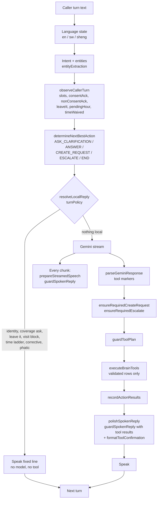

# Brain turn contract

One caller turn, one path. Every playbook (retail, home services, hospitality,
general, and any future pack) runs through the same gates. Playbooks change
what the Brain asks for and what it saves. They cannot change what it is
allowed to say or when a tool may fire. The gates live in code, not in the
prompt, so a model that leaks still cannot reach the caller or the database.

Runtime: `server.js` media loop. Offline twin: `tests/helpers/brainSimulator.js`.
Proof: `tests/brainSimulation.test.js` (in `npm run test:brain`).

## The turn



## Three gates

### 1. State gates (before the model)

Set in `brainState.observeCallerTurn` and read by `nextBestAction`,
`goalModel`, and `turnPolicy`.

| Gate | Rule | Effect |
| --- | --- | --- |
| Consent | `ackIsConsent`: Okay / Sawa / Then is a yes only when the last asked slot was `confirm`. Anywhere else it is a filler (`nonConsentAck`). | Filler never fires a tool. The Brain asks for the next missing fact. |
| Leave it | "Just leave it", "wacha", "forget it" after a block. | Speak "Okay. Nothing saved." No tool. Block line is not repeated. |
| Quantity | An order for a catalogue product needs a count the caller said (digits or words, en/sw). | "Then." asks "Diary. How many?" The saved row never carries a guessed count. |
| Visit time ladder | Day without a clock time asks "What time tomorrow?", then "Morning or afternoon?". A bare hour asks "N in the morning or afternoon?" or "Twelve noon?". | Two asks (or "any time" after one) waive the time: a callback service request is saved with "Visit time to confirm. Place: …". Never a calendar row without a time. |
| Coverage | `assessCoverage`: `inside` when the place or its county matches Train text; `outside` only when the place resolves to a county that is not covered; `unknown` when nobody can place it. | Outside speaks the block and offers a callback note. Unknown never refuses. |
| Area | A landmark with no area ("near the big church") while coverage is on file. | One ask: "Which area is that in?" Then book, with `area not confirmed, check coverage` in the notes if the caller cannot say. |
| Urgent contact | "Contact me urgently" needs a name and a concrete need. The name turn is not the need. | Escalate once, after both. Reason reads `Caller says: <need>`. |

### 2. Speech gate (`speechGuard.guardSpokenReply`)

Applied to every Gemini chunk while streaming and again to the final line with
this turn's tool results. Local lines are fixed strings and do not need it.

Dropped sentence by sentence:

- **Numbers the caller, the file, or a tool did not state.** Known set is
  caller turns, profile JSON, tool results, and state entities. Number words
  count (`numberWords.js`), so "twenty" matches "20". "One moment" is not a
  number. Hours on file as `HH:MM` allow the 12-hour form.
- **Saved / booked / noted / "the team will call"** unless a tool succeeded
  this turn.
- **Transfer claims** ("stay on the line", "transferring you") unless
  `capabilities.liveTransfer`.
- **Coverage flips** ("we can come to Runda") unless `assessCoverage` says
  inside.

If the caller asked a price, count, or time and the only answer was dropped,
the line becomes "I don't have that on file. I can note it for the team."
(sw / sheng variants). Silence is never the outcome of the guard.

### 3. Tool gate (`requiredCreateRequest.guardToolPlan`)

Runs on the parsed markers plus anything the injectors added.

- `ackWithoutConsent` deletes `serviceRequest` and `appointment`.
- A `quantity` the caller never said becomes empty.
- An appointment whose `when` has a day and no time is replaced: with
  `timeWaived`, a callback request; otherwise it is held back
  (`needsVisitTime`) and the Brain asks the time.
- Escalate carries the caller's stated need, not the decision reason.
- `executeBrainTools` still validates rows (hours, catalogue titles, junk
  names) and returns `invalid` instead of writing.

## Invariants the simulator checks after every turn

`dead_air`, `local_line_too_long` (>25 words for a fixed line), `glued_words`,
`saved_claim_without_tool`, `transfer_claim`, `invented_number_N`,
`said_landmark` (home services), `catalogue_dump`, `tool_on_ack`,
`same_question_three_times`. Any violation fails `npm run test:brain`.

## Adding a playbook without a leak

1. Add slots and required order in `goalModel.js` (`GOAL_REQUIREMENTS`,
   `missingGoalSlots`). Do not read the model text for completion.
2. Add the one-line ask for each new slot in `callCorrectives.missingSlotLine`
   (en + sw) and `dynamicSpeech.pickSpeechGuaranteeLine`.
3. Add the prompt hint in `goalModel.clarificationForSlot`.
4. Map the saved row in `requiredCreateRequest` and validate it in
   `toolExecution`. Speak the result from `formatToolConfirmation`.
5. Write a scenario in `tests/brainSimulation.test.js` with the adversarial stub
   and assert `sim.violations` is empty and the saved rows are exact.

Do not:

- Speak a fact the profile does not hold. Put it in the profile or ask.
- Add a local reply outside `turnPolicy.resolveLocalReply`.
- Fire a tool from a spoken line. Tools come from markers or injectors, then
  the tool gate.
- Import `visitTime` from `callCorrectives`, or `toolExecution` from
  `src/conversation` modules (import cycles).

## Simulator

```js
const { createSimulator } = require('./tests/helpers/brainSimulator');
const sim = createSimulator({ profile, leak: 'rotate' }); // or 'none', or a string
await sim.run(['I need carpet cleaning tomorrow.', 'Alvin.', 'Kitengela, near Naivas.', 'Tomorrow.']);
sim.transcript();  // caller / agent lines with the outcome per turn
sim.saved;         // serviceRequests, appointments, appointmentUpdates, escalations
sim.violations;    // [] on a clean call
```

The stub asks for the slot the state wants and adds one leak per turn: a
price, a transfer, a coverage flip, a booking claim, a stock count. On
`CREATE_REQUEST` it claims "Done, that is all booked" with no marker. A clean
run proves the injectors and the gates, not the model.

Staging PASS is not production GO. Re-dial the post-V5 scripts on staging with
the new SHA before promoting.
