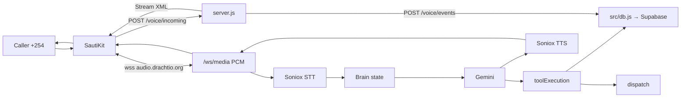
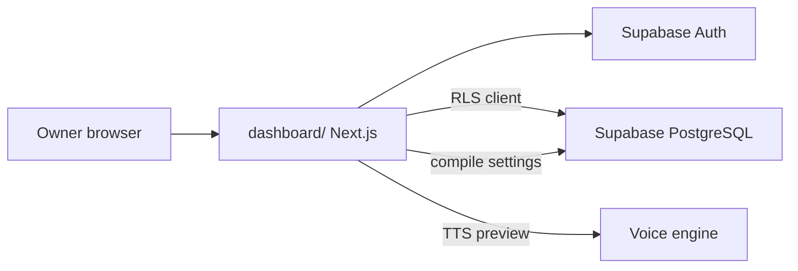
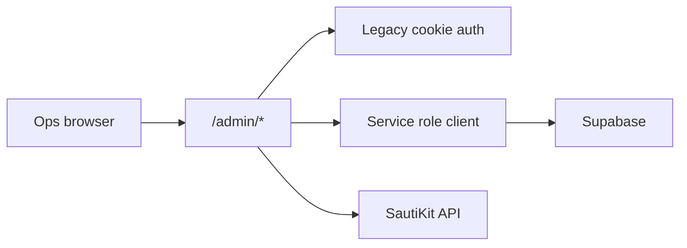
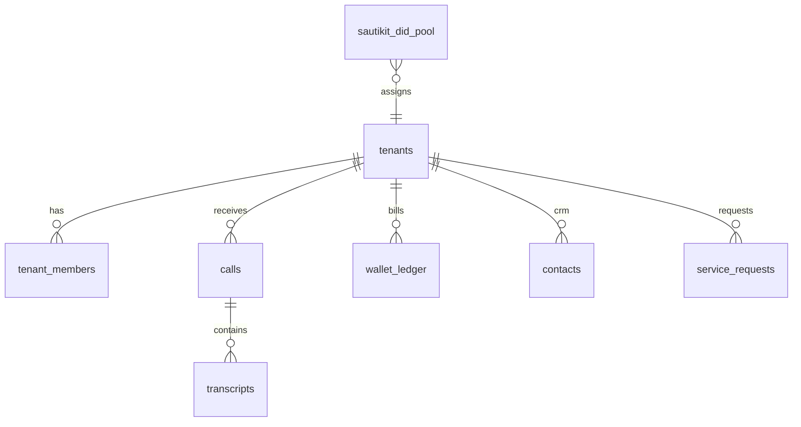

# Scalers system architecture

**Status:** Current-state documentation (2026-08-14)  
**Scope:** Components that exist in the repository today. No invented subsystems.

---

## High-level overview

Scalers has three runtime surfaces:

1. **Voice engine** — `server.js` on Railway/Render
2. **Owner desk + Super Admin** — `dashboard/` on Vercel
3. **Supabase** — PostgreSQL, Auth, Storage

External services: **SautiKit** (telephony), **Soniox** (STT/TTS), **Google Gemini** (LLM), **TextSMS** / **SautiKit WhatsApp** / **Resend** (notifications).

---

## Live call path (voice)



### Step-by-step (with file references)

| Step | Component | File(s) |
| --- | --- | --- |
| 1 | Inbound webhook | `server.js` `handleVoiceIncoming`, `src/sautikit/webhook.js` |
| 2 | Stream XML `connect="true"` | `server.js:609–612` |
| 3 | PCM WebSocket | `server.js` `mediaWss` `/ws/media` |
| 4 | STT | `src/speech/sonioxStt.js`, `sttContext.js` |
| 5 | Turn endpointing / barge-in | `turnTaking.js`, `interimBarge.js` |
| 6 | Tenant profile + prompt | `src/db.js` `getTenantProfile`, `src/prompts.js` |
| 7 | Brain state + next action | `brainState.js`, `nextBestAction.js`, `brainPolicy.js` |
| 8 | LLM turn | `server.js` `runGeminiTurnStreaming` |
| 9 | Tool parse + execute | `toolMarkers.js`, `toolExecution.js` |
| 10 | TTS + playback | `sonioxTts.js`, `ttsNormalize.js`, `spokenStreamBuffer.js` |
| 11 | Call completion | `server.js` `/voice/events`, `callResolution.js` |
| 12 | Notify owner | `src/notifications/dispatch.js` |

**LEGACY (not production path):** `/ws/relay` ConversationRelay text loop — `server.js:2261+`.

---

## Dashboard path (owner)



| Flow | Mechanism |
| --- | --- |
| Signup / login | Supabase Auth (`dashboard/src/lib/auth.ts`) |
| Onboarding | Server actions → `promptCompiler.ts` → `tenants.llm_system_prompt` |
| Settings | `TenantForm.tsx` → `settings/actions.ts` → compile + save |
| Calls inbox | `(desk)/calls/` → Supabase RLS queries |
| Wallet | `(desk)/wallet/` → read ledger via RLS |
| Phone preview | `TestLinePanel` → `VOICE_PUBLIC_BASE_URL` `/api/tts/preview` |

---

## Super Admin path



**FACT:** Super Admin bypasses owner RLS via service role on server routes (`dashboard/src/app/api/admin/*`).

---

## Database relationships (simplified)



Authoritative schema notes: `docs/supabase/schema.sql` (reference only).

---

## Deploy topology

```
                    ┌─────────────┐
                    │   Vercel    │
                    │  dashboard/ │
                    └──────┬──────┘
                           │ Supabase Auth + RLS
┌──────────┐         ┌─────▼──────┐         ┌─────────────┐
│ SautiKit │◄───────►│  Railway   │────────►│  Supabase   │
│telephony │  PCM WS │ server.js  │ service │  PG + Auth  │
└──────────┘         └────────────┘  role   │  + Storage  │
     ▲                                      └─────────────┘
     │                                              ▲
  Caller                                     Vercel reads/writes
```

---

## Module layout (actual vs target)

**FACT — implemented today:**

- `src/speech/*` — STT/TTS pipeline
- `src/conversation/*` — Brain runtime
- `src/notifications/*` — Alert dispatch
- `src/sautikit/webhook.js` — Webhook guard only (not full telephony module split)

**TARGET (not implemented):** Modular `src/telephony/`, `src/orchestrator/` — see [`../TARGET_MODULE_LAYOUT.md`](../TARGET_MODULE_LAYOUT.md).

---

## Related documents

- [`CURRENT_STATE.md`](./CURRENT_STATE.md)
- [`DATA_FLOW.md`](./DATA_FLOW.md)
- [`../agents/AGENT_ARCHITECTURE.md`](../agents/AGENT_ARCHITECTURE.md)
- [`../operations/DEPLOYMENT.md`](../operations/DEPLOYMENT.md)
