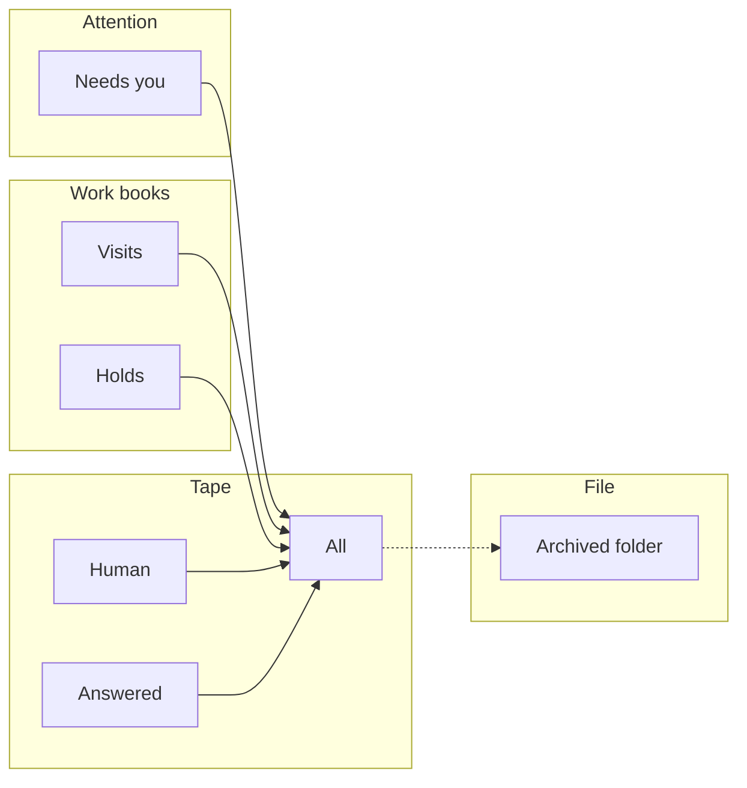
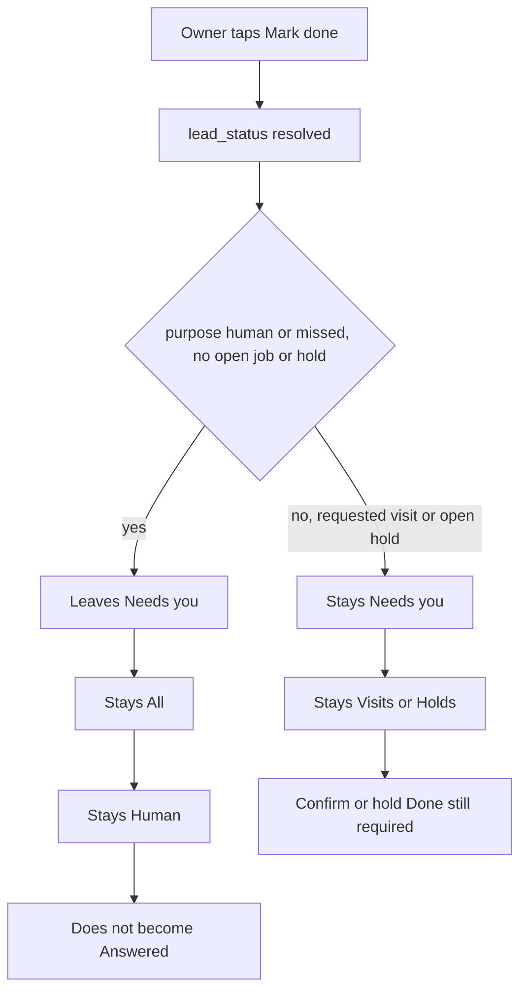
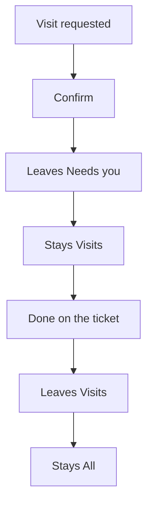
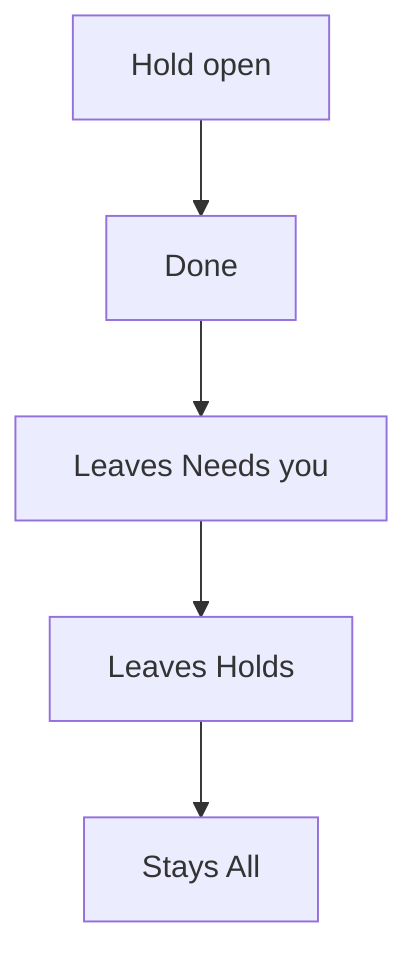
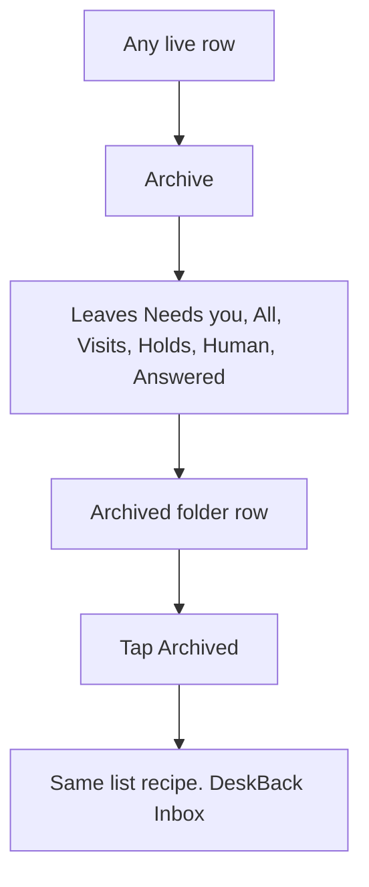
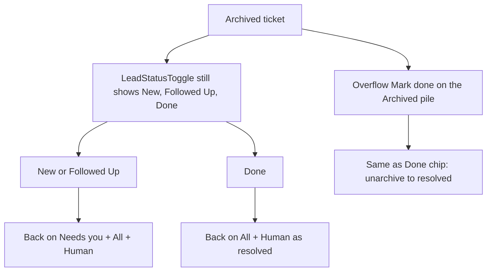
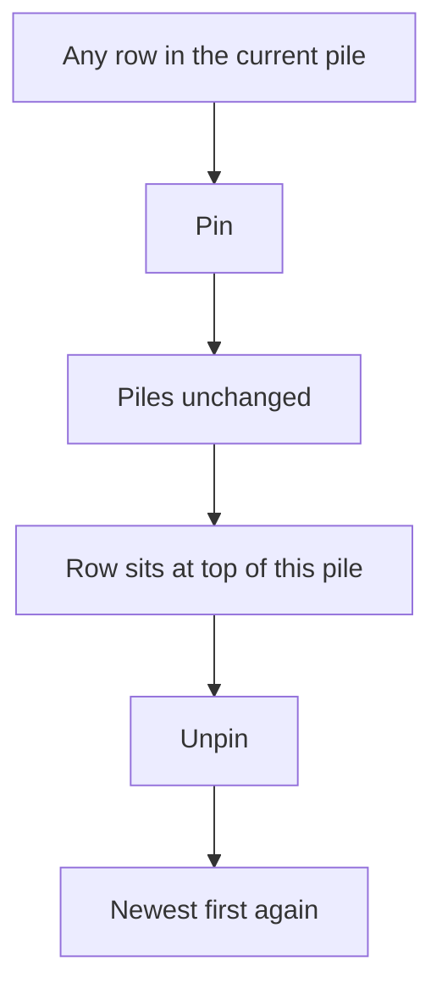
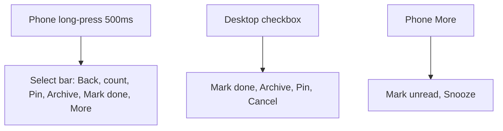
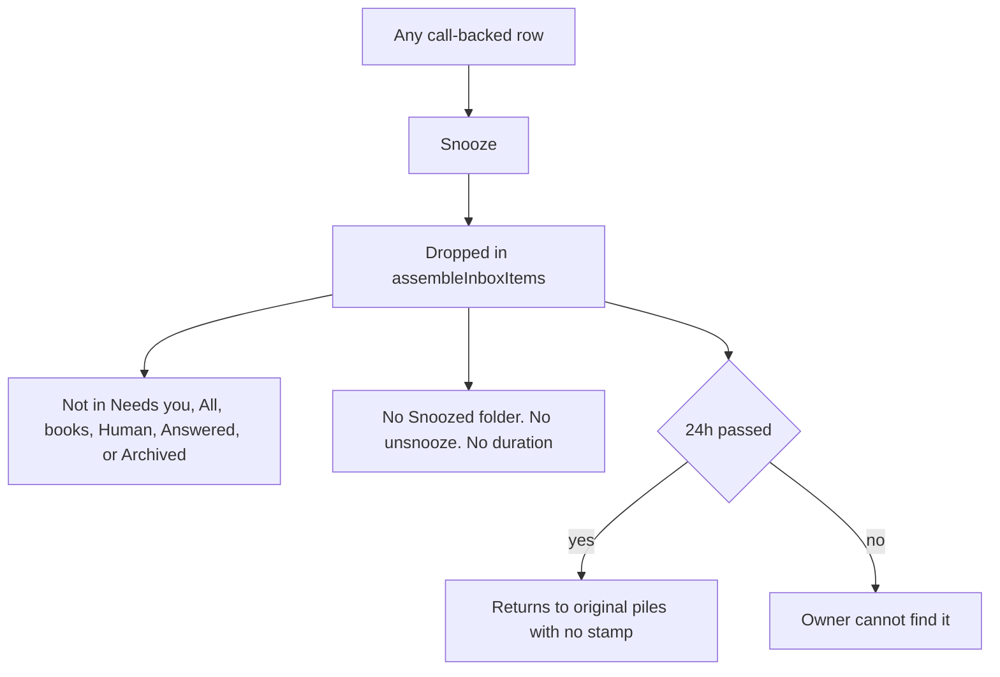
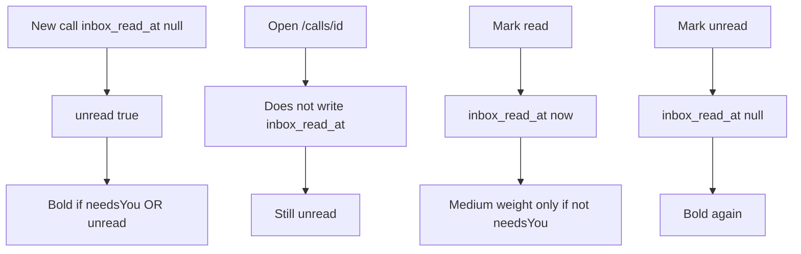

# Inbox verbs: snooze, unread, and the rest

**Status:** Diagnosis. Waiting on owner approval. No product removal in this PR.  
**Lane:** Desk UI/UX  
**Date:** 2026-09-18  
**Authority:** [`FRONTEND_CONSTITUTION.md`](../frontend/FRONTEND_CONSTITUTION.md) and [`calls.md`](../frontend/design-system/pages/calls.md) outrank this spec.  
**Evidence:** `tests/inboxVerbWorkflow.test.js` plus the shipped handlers in `inboxLeadActions.ts`, `inboxPurpose.ts`, `inboxTriageActions.ts`.

This spec answers one decision: cut Snooze and Mark unread from owner surfaces, or keep them and finish them. It also charts every other leave and stay verb so that decision is not made in isolation.

---

## Verdict (for approval)

**Remove Snooze and Mark unread from every owner surface.** Keep the database columns. Do not add a Snoozed pile or an Unread pile.

They look like Mail and WhatsApp. They do not behave like Mail and WhatsApp. Each one is a second attention channel on top of **Needs you**, with no return surface, no auto-read, and no filter. That is complexity without a job.

**Keep** Pin, Archive, Mark done (for return calls only), Confirm, hold Done, Call, WhatsApp, and Select.

**Add** a real Unarchive on the Archived folder and the archived ticket. Today Unarchive is an accident.

Do not ship any of this until the checklist at the bottom is approved.

---

## Why these two fail the product test

The 08:00 owner has one question: what still needs me. Needs you already answers it. Confirm, hold Done, Call, and WhatsApp already close the work. Archive already files what should leave the tape.

Snooze and Mark unread answer a different product: a mail client with a later pile. Scalers is not that product. FilterTabs are already at six. Constitution forbids an Unread chip. Archived is already the leave folder.

Hick: the overflow is six verbs. Cutting these two cuts a third of the menu. The phone More sheet exists **only** to park unread and snooze. Desktop bulk already omitted them. Remove the pair and the More sheet dies with them.

### Mark unread

| Mail / WhatsApp | Scalers today |
| --- | --- |
| Open thread stamps read | Ticket page never writes `inbox_read_at` |
| Unread is a count and a filter | No Unread tab. FilterTabs stay Needs you / All / Visits / Holds / Human / Answered |
| Mark unread puts it back in attention | Needs you is already attention. Unread only ORs into `deskRowWeightClass` |
| New mail starts unread, then reading clears it | New calls are unread (`inbox_read_at` null). They stay unread forever unless the owner hunts Mark read |

So unread is either noise (every new row bold) or a hidden toggle that never drives a pile. It collides with Needs you weight. It is not significant.

**Keep only if** we also ship auto-read on ticket open **and** accept unread as a cosmetic on closed rows. That is still a second attention channel. Not worth it.

### Snooze

| A finished snooze | Scalers today |
| --- | --- |
| Owner picks a duration | Fixed 24h. The label is just Snooze |
| A Snoozed pile or a due banner | No pile. No unsnooze. No due stamp on the list |
| Hide from work, still findable | `assembleInboxItems` drops the row from **every** pile, including All, search assembly, and Archived |
| Comes back with a reason | It reappears on the original pile after 24h with no explanation |

Snooze is a timed hide with no return UI. Archive already hides with a folder. Pin already keeps a row on top without hiding it. Snooze is the worse of both.

**Keep only if** we add duration, a Snoozed folder, and unsnooze. That is a seventh pile. Constitution already refused an Unread chip. Do not spend that budget here.

---

## Decoupled workflows (as shipped)

Each chart is one verb. Other verbs do not run inside it unless named.

### Attention vs work vs file

Needs you is open work. Visits and Holds are books. All is the tape. Archived is a folder row, not a FilterTabs chip.

### Mark done

Writes `lead_status = resolved`. Same handler as the ticket Mark done button.

**Tested**

- Human / missed return: leaves Needs you. Stays All + Human. Purpose does not become Answered.
- Requested visit: still Needs you + Visits. Confirm still owns the row.
- Open hold: still Needs you + Holds. List Done still owns the row.
- Answered hangup: already off Needs you. No pile change.

**Diagnosis.** Mark done is a follow-up close for return calls. It is not Confirm. It is not hold Done. Constitution copy that Mark done "stays on All and Answered" is only true when the row was already Answered. Overflow still offers Mark done on visit and hold rows, where it does nothing useful. Bulk select then **hides** the row locally (`patch hidden`), so the owner thinks the visit left. Overflow Mark done does not hide. Two UIs, two lies.

### Confirm visit (dock)

Writes appointment `status = confirmed`, then later `done`. Not `lead_status`.

**Tested.** Requested: Needs you + Visits. Confirmed: All + Visits. Visit done: All only.

### Hold Done (dock)

Writes request `status = fulfilled`.

**Tested.** Open: Needs you + Holds. Fulfilled: All only.

### Archive

Writes `lead_status = archived`. Same handler as ticket Archive. Delete is Archive.

**Tested.** Human, visit, hold, and answered all collapse to `["archived"]`. Archive does not rewrite appointment or request status. A requested visit stays `needsYou` internally. The Archived gate hides it from Needs you. Unarchive to `new` puts that visit straight back on Needs you + Visits.

Archive is the real leave verb. Keep it.

### Unarchive (gap)

There is no Unarchive label on the list, overflow, or bulk bar.

**Tested.** `lead_status` back to `new` or `contacted` restores Needs you. Back to `resolved` restores All + Human. Mark done on an archived row is an accidental unarchive.

Ticket hides the Archive button when already archived. It does not offer Unarchive. The three status chips remain clickable.

### Pin

Writes `inbox_pinned_at`. Glyph next to time. `orderInboxItems` sorts pinned first on the current pile.

**Tested.** Piles identical before and after. Older pinned row beats a newer unpinned row on All and on Archived.

Constitution says "no urgent pin" meaning the product does not auto-pin urgent work on All. Owner Pin is a manual stay. Keep it. It is the honest "deal with this later but keep it visible" verb. That is the job Snooze pretends to do.

### Select

Local UI. Not persisted.

Desktop bulk is already the target menu. Phone More exists only because unread and snooze were parked off the bar.

### Snooze

Writes `inbox_snoozed_until = now + 24h`. Overflow locally hides. Assemble then drops the row.

**Tested.** While due, `itemIsSnoozed` is true and assemble yields `[]`. `itemMatchesPurpose` would still place it. Snooze is a pre-filter, not a pile. Archived plus snooze also vanishes.

### Mark unread

Writes `inbox_read_at` null or a timestamp. No pile.

**Tested.** Piles unchanged. Closed row becomes bold when marked unread. Ticket page has no `inboxToggleRead` / `inbox_read_at`. FilterTabs have no Unread.

### Call and WhatsApp (dock)

No status write. `tel:` and `wa.me`. Return-call rows only. They do not close Needs you. Mark done or Archive still required if the owner is done.

---

## Collision map

| If the owner wants | Right verb | Trap today |
| --- | --- | --- |
| Finish a visit | Confirm, then ticket Done | Overflow Mark done leaves the visit requested. Bulk Mark done hides the row anyway |
| Fulfill a hold | List Done | Same Mark done trap |
| Close a return call | Mark done | Still sits on Human, not Answered |
| Get it out of the tape | Archive | Snooze also hides, including from Archived, with a 24h bounce |
| Keep it in my face | Pin | Snooze hides it. Unread bolds it without moving it |
| Find it later | Archived folder | Snoozed rows are not in any folder |
| Undo Archive | Missing | LeadStatusToggle chips, or Mark done on the Archived pile |
| See new work | Needs you | Unread weight on every new call |

Mute, Assign, and Label still persist on `calls` and stay off the overflow. Leave them off.

LeadStatusToggle (New / Followed Up / Done) is a second status dialect on the ticket next to Mark done and Archive. Separate cut, not this decision.

---

## Proposed target (after approval)

Phase 1 is Desk only. Do not drop `inbox_read_at` or `inbox_snoozed_until`. Platform owns schema.

**Overflow (every row):** Select, Pin / Unpin, Archive. Mark done only when the dock is Call / WhatsApp (return call, no open job or hold). Hairline between stay and leave.

**Phone select bar:** Back, count, Pin, Archive, Mark done. No More sheet.

**Desktop bulk:** Mark done, Archive, Pin, Cancel. Already this. Stop locally hiding Mark done.

**Archived pile and archived ticket:** Unarchive (ghost). Writes `lead_status = new`. Hide Mark done and Archive on archived rows so they cannot unarchive by accident.

**Dock:** unchanged. Confirm, hold Done, Call, WhatsApp.

**Ticket:** keep Mark done for open return calls. Keep Archive. Add Unarchive when archived.

**Copy / constitution after ship:** overflow list in `calls.md` and MASTER loses Mark unread and Snooze. "No urgent pin" stays: no auto-pin. Owner Pin stays.

**Not in phase 1**

- Unread pile, Snoozed pile, duration picker, auto-read-on-open
- Dropping SQL columns
- Removing LeadStatusToggle (own ticket)
- Changing Confirm / hold Done
- Changing `DESK_LINKS`, FilterTabs, or Needs you

---

## Test gate for the later removal PR

- `tests/inboxVerbWorkflow.test.js` stays green and drops unread / snooze surface assertions to "absent".
- Overflow and bulk tests no longer expect Mark unread or Snooze.
- Bulk Mark done does not `patch hidden`.
- Archived rows expose Unarchive, not Mark done.
- Dashboard lint / build.

---

## Approval

Reply with one of:

1. **Cut snooze and unread.** Ship phase 1 as specified.
2. **Cut them, with edits.** Name the edit (example: keep Mark done on visit rows).
3. **Keep them.** Then the follow-up is to finish them: auto-read, duration, a return surface. Do not leave the current shells.

Until that reply, overflow stays six verbs.
